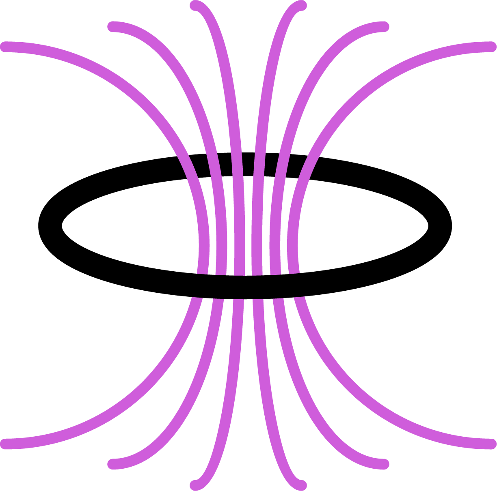
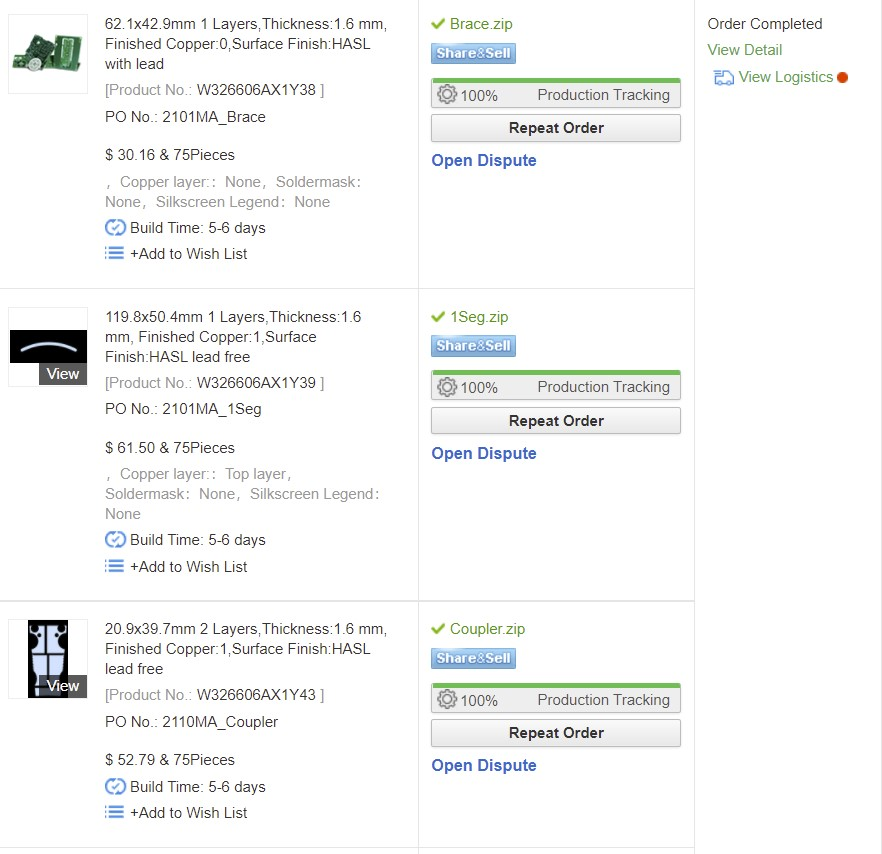
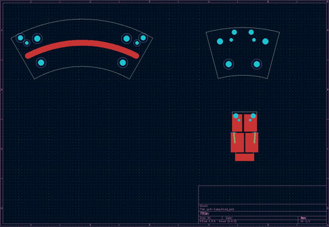
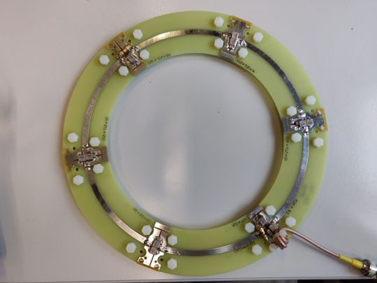
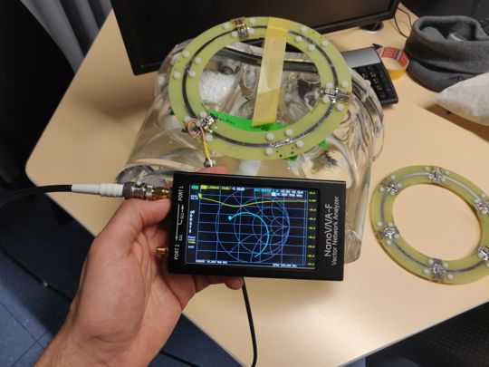
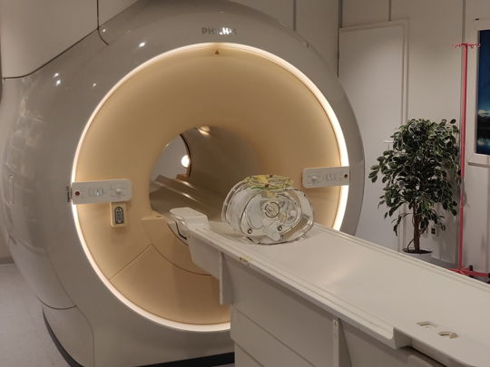
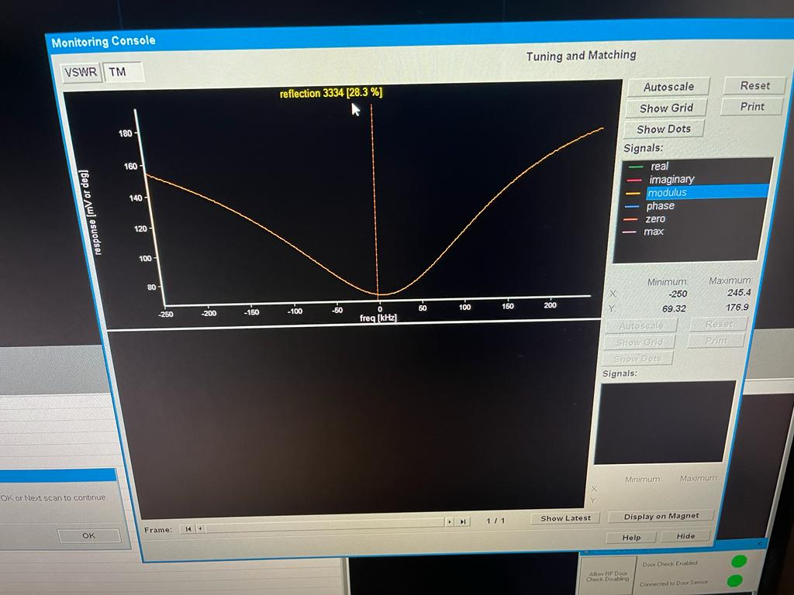

<!-- PROJECT LOGO -->
 

  
 

<h3 align="center">Rigid Ø20 cm MRI surface RF coil</h3>

<!-- ABOUT THE PROJECT -->
## **About the project**
 Design and construction of a rigid Ø20 cm surface coil using single layer FR-4. Coil geometry and segmentation are optimized to minimize E-field and reduce PCB manufacturing cost. 

### Designed and simulated with
* [KiCAD 6.02]
* [CST Microwave Studio (EM simulator)]
***

<!-- METHOD -->
## **Design**

<!-- CRITERIA -->
### **Criteria**
* Rigid coil
* 20 cm diameter
* Frequency and matching tunable
* Transmit/receive 

<!-- SEGMENTATION & TUNING -->
### **Coil segmentation and tuning**
The coil is intended for use on a biological samples with a relative dielectric constant . If the coil is intended for  1H detection at 3 Tesla, the Lamour frequency  corresponds to a wavelength within the patient 

Rule of thumb stipulates contagious length of the coil should be , which translates to .

In this example the coils are intended for 13C, which has a gyromagnetic ratio four times lower than 1H and thus a 3T Lamour frequency of . When considering the coil segmentation, the rule of thumb suggests a maximum conductor length of .

The conductor length  resulting in a simulated coil inductance of . Given the low resonant frequency, 6 segments ( were selected to maintain reasonable low tuning capacitors. Accounting for gaps to solder capacitors, the segmentation rule of thumb should be satisfied.

The required lumped capacitance to achieve resonance is . Given the six segments, .

<!--MATCHING -->
### **Matching**
The ideal matching capacitance has been determined via simulation to be  and verified experimentally (using thigh to load the coil). Matching capacitance for an unloaded coil can be analytically approximated given prior knowledge of the coil capacitance and ohmic resistance at DC.

(<a href="#top">back to top</a>)

***

<!-- CONSTRUCTION & FABRICATION -->
## Construction & Fabrication

<!-- BILL OF MATERIALS -->

### **Bill of materials**

* Capacitors were ceramic non-magnetic, purchased from Knowles Syfer and rated to at least 2kV WVDC. 
* Trimmer capacitors for variable tuning and matching were purchased from Knowles Voltronics (V9000).
* 24 x M5 x 8 mm nylon screws.
* 24 x M5 nylon nuts.
* 24 x M5 washers.

<!-- PCB FABRICATION -->
### **PCB fabrication**

The coil is has been design in CST microwave stuido and exported to KiCAD PCB editor (KiCAD and Gerber files available). The coil is made of 6 x 3 PCB pieces: 
* '1-seg' PCB consist of a arched PCB hosting a single 5 mm thick trace. 
* 'Brace' PCB is an empty PCB which lines up between (under) two neighboring '1-seg' PCBs and mechanically couples them together
* 'Coupler' PCB has Castellated and is soldered between (above) two neighboring '1-seg' PCBs to host tuning/matching capacitors and a coaxial cable.

Provided the surface coil is segmented into smaller boards - then fabrication is relatively affordable arriving to 144.45 USD for 12 coils (~12 USD per coil).

The PCBs 1-seg and Brace are mechanically fastened together using nylon screws.

Note, Not all couplers need to be solder on if less than 6 segments are required.  

(<a href="#top">back to top</a>)

***

<!-- Images -->
## Images

(<a href="#top">back to top</a>)

***

<!-- LICENSE -->
## License

Distributed under the MIT License. See `LICENSE.txt` for more information.

<!-- CONTACT -->
## Contact

Mohammed M. Albannay - [@Bannay](https://twitter.com/bannay) - bannay@gmail.com

Project Link: [https://github.com/bannay/rigid-surfacecoil](https://github.com/bannay/rigid-surfacecoil)

<!-- ACKNOWLEDGMENTS -->
## Acknowledgments

* [Readme template](https://github.com/othneildrew/Best-README-Template)

(<a href="#top">back to top</a>)

***
